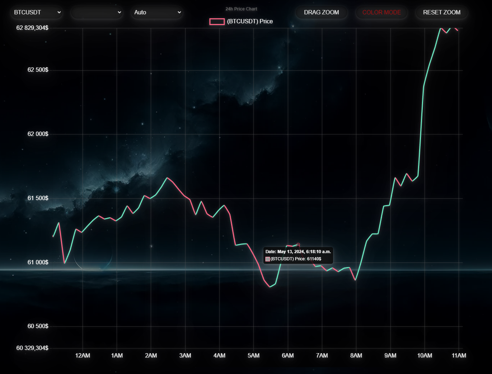
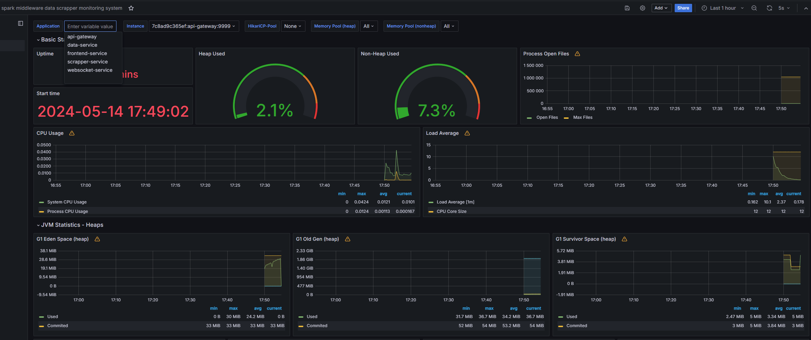
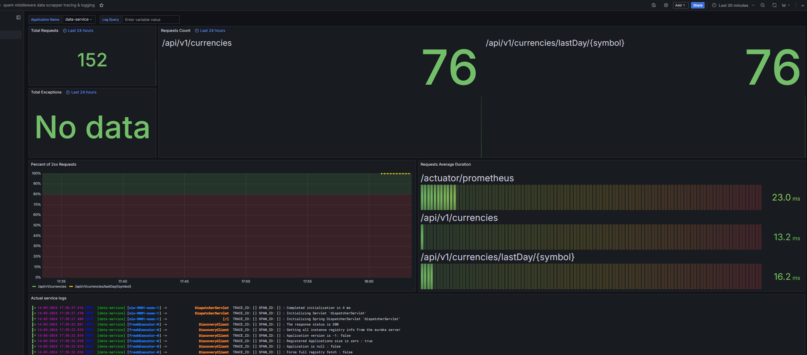
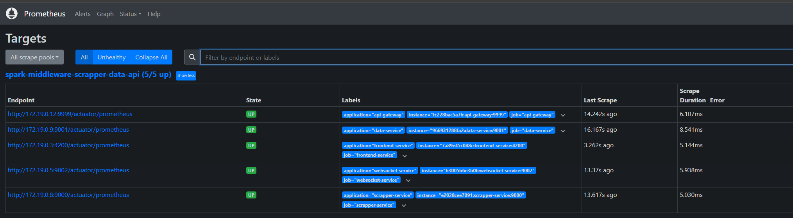
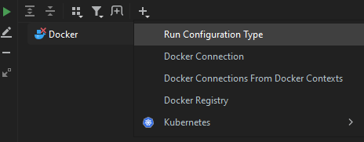
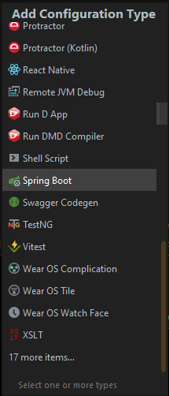
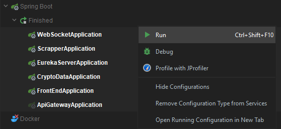

<br>
<h1 align="center">Spark Middleware Data Scrapper</h1>
<br>

<p align="center">
  This application is designed to scrape market data from the Binance API and retrieve it using REST or WebSocket clients. Scraped data is then visualized on a responsive, user-friendly, and colorful chart powered by Chart.js.
</p>

<p align="center">
  
</p>
<br>

<h1 align="center">Data Scraping</h1>

<h1 align="left">
Source:
</h1>
Application scrapes market data from Binance, including prices, in future -> trading volumes, and other relevant metrics.

<h1 align="left">
Frequency: 
</h1>
Data can be scraped at regular intervals or in real-time, depending on the configuration.

<h1 align="left">
Asychronously: 
</h1>
Scraping the Binance API and pushing updates is performed asynchronously to ensure optimal real-time data retrieval for all currencies simultaneously.
This approach maximizes efficiency, allowing the data service and WebSocket sessions to be updated as quickly as possible, ensuring users receive the most current information without delay.
<br>

<h1 align="left">
Connection failure: 
</h1>
Scrapper service is designed to handle connection timeouts or failures gracefully.
It will automatically retry each scrape or data push operation, with configurable retry attempts and intervals,
ensuring robust and reliable data collection even in the face of connectivity issues.
<br>


<h1 align="center">Data Service</h1>

<h1 align="left">
Rest API:
</h1>
Data service provides the capability to retrieve data from the database via REST API endpoints, allowing for flexible and on-demand data access.

<h1 align="left">
WebSocket: 
</h1>
Application also supports real-time data retrieval through WebSocket connections, enabling instantaneous updates and live data streaming directly from the datasource.

<h1 align="left">
Database : 
</h1>
The entire dataset is stored within a lightweight SQLite database, optimized with several indexes to maximize data retrieval speed.

<h1 align="left">
Time Zone Support : 
</h1>
Data service supports user-specified time zones, ensuring that data values are returned in the correct local time for the specified region.


<br>
<br>
<br>


<h1 align="center">Fully scaled & tracked infrastructure (almost)*</h1>

<p align="center">
Application is build as a fully scaled infrastructure with possibility to load up more instances if needed.
</p>
<br>
<p align="center">
*
Websocket service needs to be upgraded with external DB storage for session data storage.I recommend mongoDB. Then we need message broker for dynamic user connected instanceId recognition.
</p>

<h2 align="left">
Eureka: 
</h2>

Used for service discovery and registration, allowing services to locate and communicate with each other without hardcoding service locations.

<h2 align="left">
Spring Cloud Feign: 
</h2>

Simplifies the development of RESTful clients by providing a higher-level abstraction over HTTP clients. This enables declarative REST calls between microservices.

<h2 align="left">
API-Gateway:
</h2>

The API Gateway pattern is used to communicate with the entire infrastructure using a single, stable address.
It not only enables the implementation of robust security measures across the entire infrastructure but also
encapsulates and abstracts internal services, providing a streamlined and secure interface for external access.


<h2 align="left">
Prometheus: 
</h2>

An open-source monitoring and alerting toolkit that collects metrics from your services and infrastructure, helping you detect and diagnose issues in real time.

<h2 align="left">
WebSocket Service: 
</h2>

Utilizes SockJS and STOMP protocol for handling real-time, session-based communication.

<h2 align="left">
Grafana with Loki and Promtail:
</h2>
Grafana is used for metric visualization and monitoring dashboards, with Loki log aggregation system and Promtail that ships the logs to Loki are dispatched for logging and log aggregation.


<br>
<br>
<br>


<br>
<h1 align="center">Chart GUI :</h1>
<br>


<h2 align="center">Entry Load Animation</h2>

<p align="center">
  
</p>

<br>

<h2 align="center">Real Time Chart Update
<br>
(offcourse works best if scrapping is set for every few sec's)
</h2>

<p align="center">
  
</p>

<br>

<h2 align="center">Currency Switch Animation</h2>

<p align="center">
  
</p>

<br>

<h2 align="center">Bullish/Bearish Color Mode</h2>

<p align="center">
  
</p>

<br>

<h2 align="center">Flexible Chart Mouse Movement</h2>

<p align="center">
  
</p>

<br>

<h2 align="center">Drag Zoom Option & Reset Zoom Button</h2>

<p align="center">
  
</p>

<br>

<h2 align="center">Scroll Mouse Zoom</h2>

<p align="center">
  
</p>

<br>

<h2 align="center">Chart Timescale Switch</h2>

<p align="center">
  
</p>

<br>

<h2 align="center">Load user settings data from local storage cache</h2>

<p align="center">
  
</p>

<br>

<h2 align="center">Services Monitoring:</h2>

<p align="center">
  
</p>

<br>

<h2 align="center">Services Tracing & Logging:</h2>

<p align="center">
  
</p>

<br>

<h2 align="center">Prometheus targets:</h2>

<p align="center">
  
</p>

<br>


<h1 align="center">Project compilation & local docker mount:</h1>

```bash
 mvn clean install jib:dockerBuild -Plocal
```

<h1 align="center">Docker deployment:</h1>

```bash
docker compose up
```
<br>


<h1 align="center">Running on localhost environment</h1>

```bash
 mvn clean install
```

<h2 align="center">& run all spring services</h2>

<h3 align="center">1.</h3>

<p align="center">

</p>

<h3 align="center">2.</h3>


<p align="center">

</p>

<h3 align="center">3.</h3>

<p align="center">

</p>


<br>
<br>


<h2 align="center">
  After starting the application, please wait about one minute until all clients register correctly with the Eureka server.
</h2>

<br>
<br>


<h1 align="center">Services Url's:</h1>

|       Service        |                       LOCAL                        |                                          OpenAPI                                           | Login  |  Password   |
|:--------------------:|:--------------------------------------------------:|:------------------------------------------------------------------------------------------:|:------:|:-----------:|
|   Scrapper-Service   |  [http://localhost:9000/](http://localhost:9000/)  |                                             x                                              |   x    |      x      |
|     Data-Service     |  [http://localhost:9001/](http://localhost:9001/)  | [http://localhost:9001/swagger-ui/index.html](http://localhost:9001/swagger-ui/index.html) |   x    |      x      |
|  WebSocket-Service   |  [http://localhost:9002/](http://localhost:9002/)  |                                             x                                              |   x    |      x      |
|   Frontend-service   |  [http://localhost:4200/](http://localhost:4200/)  |                                             x                                              |   x    |      x      |
|     Api-Gateway      |  [http://localhost:9999/](http://localhost:9999/)  |                                             x                                              |   x    |      x      |
|    Eureka-Server     |  [http://localhost:8761/](http://localhost:8761/)  |                                             x                                              |   x    |      x      |
|                      |                                                    |                                                                                            |        |             |
|      Prometheus      |  [http://localhost:9090/](http://localhost:9090/)  |                                             x                                              |   x    |      x      |
|       Grafana        |  [http://localhost:3000/](http://localhost:3000/)  |                                             x                                              | admin  |   secret    |
|        Zipkin        |  [http://localhost:9411/](http://localhost:9411/)  |                                             x                                              |   x    |      x      |


<h1 align="center">Frontend Service API:</h1>

|                         FRONTEND SERVICE URL                         |                             GATEWAY URL                              |                  Description                  |
|:--------------------------------------------------------------------:|:--------------------------------------------------------------------:|:---------------------------------------------:|
| [http://localhost:4200/chart-rest](http://localhost:4200/chart-rest) | [http://localhost:9999/chart-rest](http://localhost:9999/chart-rest) |    Data visualisation based on REST client    |
|   [http://localhost:4200/chart-ws](http://localhost:4200/chart-ws)   |   [http://localhost:9999/chart-ws](http://localhost:9999/chart-ws)   | Data visualisation based on WebSocket client  |

<h1 align="center">Data Service API:</h1>

| METHOD |                                                         URL                                                         |                     Description                      |   REQUEST PARAMS    |  PATH VARIABLE  |            REQUEST BODY             |
|:------:|:-------------------------------------------------------------------------------------------------------------------:|:----------------------------------------------------:|:-------------------:|:---------------:|:-----------------------------------:|
|  GET   |                            [/api/v1/currencies](http://localhost:9001/api/v1/currencies)                            |         Returns all available currency pairs         | String {userZoneId} |        x        |                  x                  |
|  GET   |           [/api/v1/currencies/lastDay/{symbol}](http://localhost:9001/api/v1/currencies/lastDay/BTCUSDT)            | Returns last 24h chart history of specified currency | String {userZoneId} | String {symbol} |                  x                  |
|  GET   |                    [/api/v1/currencies/lastAll](http://localhost:9001/api/v1/currencies/lastAll)                    |  Returns all available currency pairs latest values  | String {userZoneId} |        x        |                  x                  |
|  GET   |              [/api/v1/currencies/last/{symbol}](http://localhost:9001/api/v1/currencies/last/BTCUSDT)               |        Returns last specified currency value         | String {userZoneId} | String {symbol} |                  x                  |
|        |                                                                                                                     |                                                      |                     |                 |                                     |
|  PUT   |                 [/api/v1/management/currencies](http://localhost:9001/api/v1/management/currencies)                 |   Updates currency pair data based on request data   |          x          |        x        |   CurrencyPairUpdateRequest.Class   |
|  POST  |                 [/api/v1/management/currencies](http://localhost:9001/api/v1/management/currencies)                 |   Creates currency pair data based on request data   |          x          |        x        |   CurrencyPairCreateRequest.Class   |
| DELETE |                 [/api/v1/management/currencies](http://localhost:9001/api/v1/management/currencies)                 |   Deletes currency pair data based on request data   |          x          |        x        |   CurrencyPairDeleteRequest.Class   |
|  POST  | [/api/v1/management/currencies/scrapper/update](http://localhost:9001/api/v1/management/currencies/scrapper/update) | Internal method for scrapper service to update data  |          x          |        x        | ScrappedCurrencyUpdateRequest.Class |

<h1 align="center">WebSocket Service API:</h1>

| METHOD |                                                           URL                                                           |                     Description                      |  REQUEST PARAMS   | DESTINATION VARIABLE |            REQUEST BODY             |
|:------:|:-----------------------------------------------------------------------------------------------------------------------:|:----------------------------------------------------:|:-----------------:|:--------------------:|:-----------------------------------:|
|   x    | [http://localhost:9002/websocket/info?timezone={timeZone}](http://localhost:9002/websocket/info?timezone=Europe/Warsaw) |                  HandShake endpoint                  | String {timezone} |          x           |                  x                  |
|   x    |                    [ws://localhost:9002/ws/api/v1/currencies](ws://localhost:9002/api/v1/currencies)                    |         Returns all available currency pairs         |         x         |          x           |                  x                  |
|   x    |   [ws://localhost:9002/ws/api/v1/currencies/lastDay/{symbol}](ws://localhost:9002/api/v1/currencies/lastDay/BTCUSDT)    | Returns last 24h chart history of specified currency |         x         |   String {symbol}    |                  x                  |
|   x    |         [ws://localhost:9002/ws/api/v1/currencies/lastAll](ws://localhost:9002/api/v1/currencies/lastAll)          |  Returns all available currency pairs latest values  |         x         |          x           |                  x                  |
|   x    |     [ws://localhost:9002/ws/api/v1/currencies/last/{symbol}](ws://localhost:9002/ws/api/v1/currencies/last/BTCUSDT)     |        Returns last specified currency value         |         x         |   String {symbol}    |                  x                  |
|        |                                                                                                                         |                                                      |                   |                      |                                     |                              |                                                      |
|  POST  |                       [http://localhost:9002/api/v1/events](http://localhost:9002/api/v1/events)                        | Internal method for scrapper service to update data  |         x         |          x           | ScrappedCurrencyUpdateRequest.Class |

